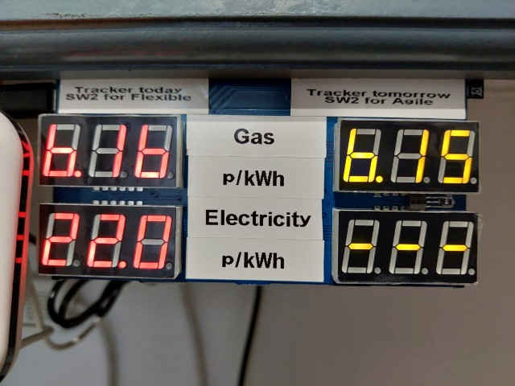

# Octopus Unit Rate Display for ESP32

**IMPORTANT**: This uses the 'old' API which is pretty much broken now. I have a new version which uses the new API, which brings various benefits including the elimination of the problem of the API returning high prices when the real prices aren't available yet, and the ability to show tomorrow's price. The new version can also show the Agile and Flexible prices for comparison. I'll upload it when I get round to it... please open an issue if you're interested and I still haven't uploaded it yet.



This project gets JSON data from https://octopus.energy

The JSON data is parsed and used to get today's gas and electricity unit rates for the **Tracker** tariff.

Prices are displayed on two 3-digit 7-segment displays to two decimal places if the unit rate is less than 10.00, or one decimal place if the unit rate is greater than or equal to 10.00. Values greater than or equal to 100.00 are displayed with no decimal places.

Negative prices are also supported in case that ever happens in the future and to reduce the work required to adapt the project for **Agile** (not currently supported). In such an event, the first digit will be used for the '-' character.

# Installation

You'll need to install esp-idf to build this project.

```
git clone https://github.com/deveon95/octopus-unit-rate-display
cd esp-idf-json/json-http-client2
chmod 777 getpem.sh
./getpem.sh
idf.py menuconfig
idf.py build flash monitor
```

the getpem.sh script gets the https certificate for octopus.energy. HTTPS is mandatory to use the Octopus API, and this step cannot be skipped! The script does work on Windows as well as Linux; you can run the script with Windows Subsystem for Linux, and you may already be able to run it without installing anything extra if you've installed Git for Windows.

# Configuration
The configuration is opened by running idf.py menuconfig.

You'll need to set the wifi SSID and password so that the ESP32 can connect to the internet, and the tariff code for the most accurate prices.


To see the console output, set the log verbosity to Info. To disable console output, set to None.


# Console output   
When enabled in the configuration, the console output will show all the unit rates returned by the server, usually for every day of the current month.

# Hardware schematic


For further details of the hardware, please see [my blog](https://nick-elec.blogspot.com/2023/03/esp32-based-octopus-tracker-unit-rate.html)
